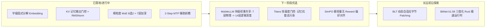

# 51-极小模型前沿技术调研与nanoSeek优化路线

## 一、 调研背景与定位
nanoSeek 作为一个在消费级硬件（8GB 显存 / AMD RX 6600）上探索的极小语言模型（1M~10M 参数量级），核心挑战在于：**在极度受限的参数预算与有限的训练步数内，最大化非线性表达力、消灭对话重复坍缩、消除词表冗余与话术固化。**

本文档对 2024~2026 年学术界与工业界在 **极小模型（Ultra-Small LMs / Edge LLMs）** 领域的核心突破进行系统调研，并形成针对 nanoSeek 架构的演进路线图。

---

## 二、 前沿技术全景与核心方案

### 1. 输入表征革新：彻底消除词表包袱 (Token-free / Byte-level)
* **Meta BLT (Byte Latent Transformer, 2024)**:
  * **机制**：完全抛弃预训练分词器（BPE），以原生 UTF-8 字节作为输入。BLT 训练一个轻量级字节熵预测器（Byte Entropy Model），当输入遇到边界或不可预测的字符（信息熵超过阈值）时，动态切分出一个 Byte Patch 并压缩为 Latent Token，送入深层 Transformer 处理，输出端再解码为字节。
  * **对 nanoSeek 的价值**：彻底消除 BPE 把咨询话术合并为高频 Token 的结构性顽疾；相较于固定 3 字节聚合窗，自适应 Patching 能在保持高压缩比的同时不破坏汉字边界。
* **汉字偏旁/部首/笔画因式分解 (Radical/Glyph Factorization)**:
  * **机制**：将 4,600+ 常用汉字拆解为「214 康熙部首 + 400 声韵母 + 5 种基本笔划」的层次化编码。
  * **效果**：嵌入表规模从 4,600 $\to$ 700 以内，嵌入参数从 11 万降至 1.5 万（-86%），彻底杜绝任何生僻字 OOV。

---

### 2. 拓扑与参数复用：以 3M 物理参数发挥 14 层深度
* **Meta MobileLLM (2024) 核心原则**:
  * **深窄优于浅宽 (Deep and Narrow)**：在固定参数量下，12~16 层深窄架构的归纳偏置与逻辑推理能力大幅超越 6 层浅宽架构。
  * **块级跨层权重共享 (Immediate Block-wise Weight Sharing)**：
    第 $i$ 层与第 $i+1$ 层共享核心 Attention 与 FFN 投影矩阵，但各自保留独立的 RMSNorm、门控标量与 RoPE 偏移。
    * 物理参数：保持 6 层（~2.5M~3.0M）；
    * 有效计算深度：等价于 12 层前向传播，极大增强表征深度而无需增加显存参数。
* **Universal Transformer (循环迭代深度)**:
  * 定义 2~3 个强力 Block，隐藏状态在 Block 间循环迭代 2~3 轮，配合可学习的循环步数门控。

---

### 3. 线性注意力与神经记忆：抗混叠与惊喜度写入
* **Google Titans: Learning to Memorize at Test Time (2024.12)**:
  * **核心痛点**：传统线性记忆（如 nanoSeek P1）采用无条件累加 $S_t = r S_{t-1} + k_t v_t^T$，长文本中大量日常废话/套话会迅速填满黑板，造成键值混叠与检索精度下降。
  * **解决方案**：引入 **Surprise Metric（预测惊喜度）** 与 **动量记忆梯度更新**：
    $$S_t = (1 - \alpha_t) S_{t-1} + \eta_t \cdot \nabla \mathcal{L}_{\text{surprise}}(x_t)$$
    当且仅当输入的 token 令模型产生预测偏差（高信息量）时才强力写入记忆，低信息量的套话自动忽略。
* **RWKV-7 (Goose) / DeltaNet 矩阵记忆律**:
  * 引入动态先擦后写律 $S_t = r S_{t-1} + \beta (v_t - S_{t-1} k_t) k_t^T$，配合通道特异性衰减，实现长程状态精准联想。

---

### 4. 极致推理与部署量化：BitNet b1.58
* **1.58-bit 纯三值化架构 (BitNet b1.58)**:
  * 权重张量 $W \in \{-1, 0, 1\}$，激活保持 8-bit / 16-bit。
  * **收益**：
    1. **矩阵乘法消灭**：全部 GEMM 退化为整数加减法累加，大幅降低内存带宽与功耗；
    2. **体积压制**：3M 参数模型全量权重仅占用 **~600 KB**，单核 CPU 推理吞吐可达 200+ tok/s；
    3. 特别契合 nanoSeek 的 Rust Candle 原生运行时。

---

### 5. 对齐与长程一致性目标
* **SimPO (Simple Preference Optimization) 极轻量偏好对齐**:
  * 无需额外训练 Reward Model，直接利用长度归一化的对数似然差值：
    $$\mathcal{L}_{\text{SimPO}} = -\log \sigma \left( \frac{\beta}{|y_w|} \log \pi(y_w|x) - \frac{\beta}{|y_l|} \log \pi(y_l|x) - \gamma \right)$$
  * 在 500~1000 条高质量闲聊 vs 套话对比对上微调，可在一瞬间清洗掉顽固话术。
* **MTP 自蒸馏 (Multi-Token Self-Distillation)**:
  * 利用 $t+1, t+2$ 辅助头输出与主干网络下一步 Logits 计算 KL 散度一致性损失，无需额外数据提升多步语义规划能力。

---

## 三、 nanoSeek 落地演进路线图 (Roadmap)

---

## 四、 结论与决策
1. **短期验证**：当前 7 层全要素 3.02M 架构已融合了细粒度 MoE、KV 门控与 MTP 辅助，作为现阶段基准最为扎实。
2. **中期突破点**：下一步在网络结构上最值得尝试的是 **MobileLLM 式跨层权重共享**（以 3.0M 参数换取 12~14 层的非线性表达力）与 **SimPO 话术排斥对齐**。
